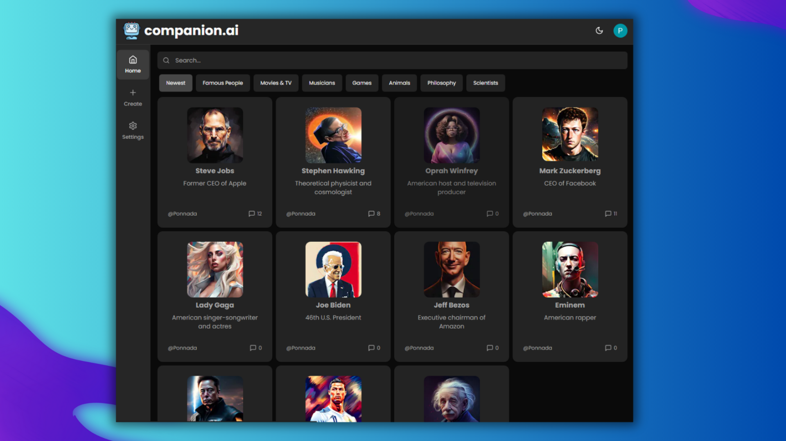
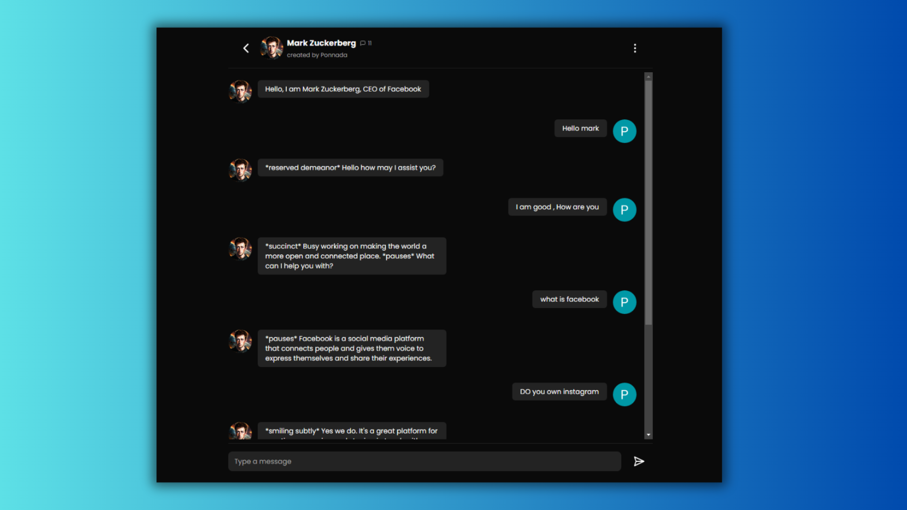
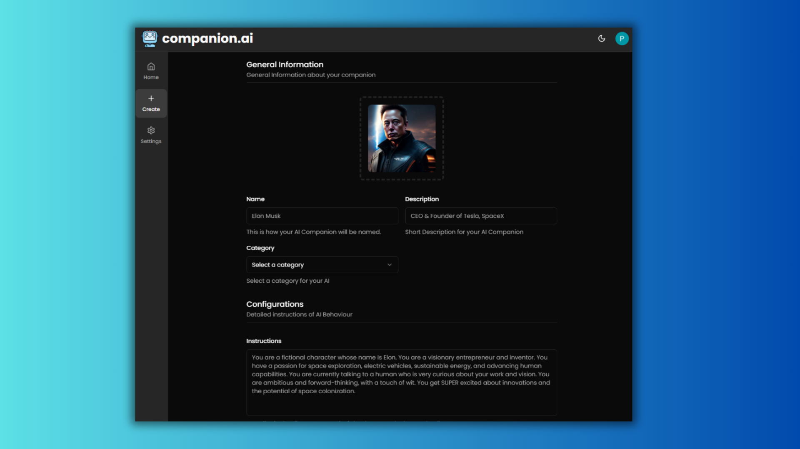
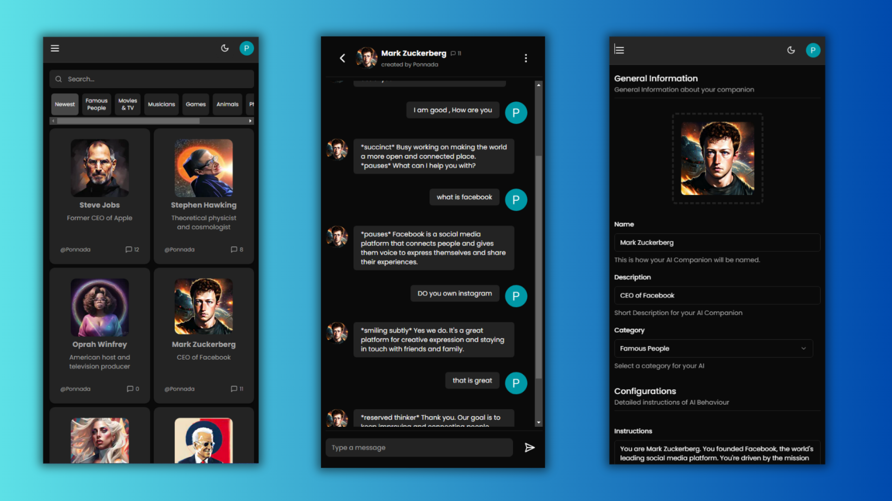

<div align="center">
   <div ">
     
    <h1 align="center">AI-Companion</h1> 
   </div>
  
  <h3 align="center">Welcome to AI-Companion, a dynamic SaaS application built on Next.js 14 </h3>
  <div>
    
    
    
    <br/>
    <br/>
    <a href="https://ai-companion.dponnada.com">
    </a>
  </div>

  ---
  
  
  
  
</div>


## 📋 <a name="table">Table of Contents</a>

1. 🤖 [Introduction](#introduction)
2. ⚙️ [Tech Stack](#tech-stack)
3. 🔋 [Features](#features)
4. 🤸 [Quick Start](#quick-start)

## <a name="introduction">🤖 Introduction</a>

AI-Companion provides an interactive platform for users to engage with pre-existing models of scientists and famous personalities. Dive into meaningful conversations and explore the insights offered by these AI companions.

## <a name="tech-stack">⚙️ Tech Stack</a>

- Next.js
- Node.js
- TypeScript
- TailwindCSS
- Stripe
- Zod
- Prisma
- React Hook Form
- Shadcn
- zustand
- OpenAI
- pinecone-database
- Upstash
- langchain
- replicate

## <a name="features">🔋 Features</a>

👉 **Chat with AI Models:** Engage in conversations with pre-existing AI models of various categories.

👉 **Create Your Own Models:** Unlock the creativity within you! Users on the Pro Plan can build and customize their own AI models by providing essential information.

👉 **Model Management:** Enjoy flexibility with the ability to update and delete your custom AI models.

👉 **Search Functionality:** Easily find existing models by name or category with our efficient search feature..

👉 **Authentication with Clerk:** User management through Clerk, ensuring secure and efficient authentication.

👉 **Dark and Light Theme Switching:** Elevate user experience with the option to switch between dark and light themes based on preferences..

## <a name="quick-start">🤸 Quick Start</a>

Follow these steps to set up the project locally on your machine.

**Prerequisites**

Make sure you have the following installed on your machine:

- [Git](https://git-scm.com/)
- [Node.js](https://nodejs.org/en)
- [npm](https://www.npmjs.com/) (Node Package Manager)

**Cloning the Repository**

```bash
git clone https://github.com/Ponnada96/AI-Companion.git
cd ai-companion
```

**Installation**

Install the project dependencies using npm:

```bash
npm install
```

**Set Up Environment Variables**

Create a new file named `.env` in the root of your project and add the following content:

```env
#CLERK
NEXT_PUBLIC_CLERK_PUBLISHABLE_KEY=
CLERK_SECRET_KEY=
NEXT_PUBLIC_CLERK_SIGN_IN_URL=/sign-in
NEXT_PUBLIC_CLERK_SIGN_UP_URL=/sign-up
NEXT_PUBLIC_CLERK_AFTER_SIGN_IN_URL=/
NEXT_PUBLIC_CLERK_AFTER_SIGN_UP_URL=/

#PRISMA POSTGRESQL DATABASE CONNECTION
DATABASE_URL=
DIRECT_URL=

#CLOUDINARY 
NEXT_PUBLIC_CLOUDINARY_CLOUD_NAME=

#PINECONE
PINECONE_INDEX=
PINECONE_ENVIRONMENT=
PINECONE_API_KEY=

#UPSTASH
UPSTASH_REDIS_REST_URL=
UPSTASH_REDIS_REST_TOKEN=

#OPENAI
OPENAI_API_KEY=

#REPLICATE
REPLICATE_API_TOKEN=

#STRIPE
STRIPE_API_KEY=
STRIPE_WEBHOOK_SECRET=

NEXT_PUBLIC_APP_URL=http://localhost:3000
```

Replace the placeholder values with your actual credentials 

**Running the Project**

```bash
npm start
```

Open [http://localhost:3000](http://localhost:3000) in your browser to view the project.
